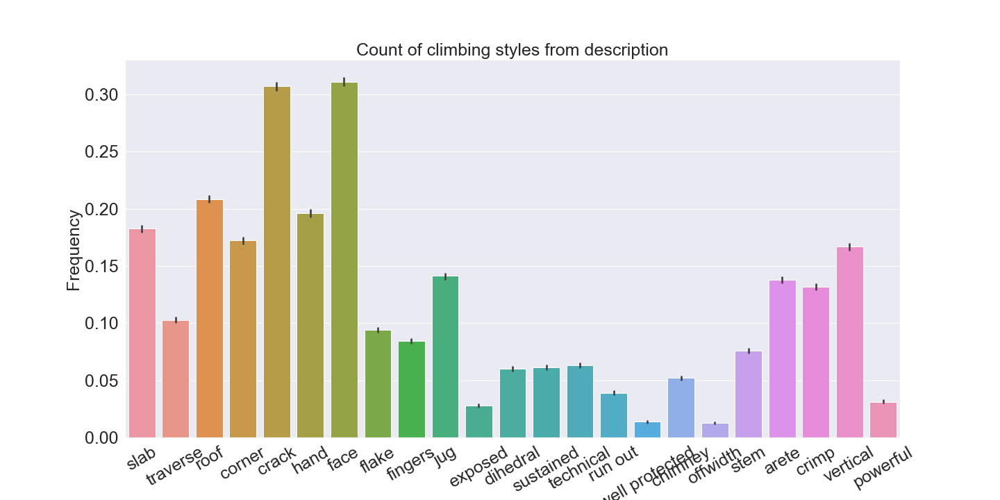

# climb_recommender

## Description
Content based climbing recommendation system. Information about ~36,000 climbs (mostly across North America) 
- User provides
 - Reference climb
 - Zip code, or city & state
 - Search radius
 - Program then displays reference climb details and top 10 matches
 
## Demo
- Video link(coming soon)
 
## Features
- General features include
- Difficulty Grade
 - 3rd class - 5.15d, V-easy - V16, etc.
 - Star rating
 - 1-5 stars
 - Type of climb
 - Sport, Trad, Bouldering, Alpine etc.
 - Pitches (length of the climb)
 
### Feature Engineering
 - Used route description for feature engineering
- NLP, LDA and domain knowledge to get keywords
 - Keywords used as features that describe the route
  - slab 
  - roof
  - crimp
  - crack
  - etc

## EDA 

### This is the general distribution on climbing types

### This shows the counts for the amount of climbs containing keywords

## Next Steps
- Build system that allows user to ask for match based on features rather than an actual climb
 - User selects
  - Difficulty rating, Sport/Trad, # of pitches
  - Keyword selection:
   - Crimp, crack, overhung, corner, slab etc
- Scrape additional websites for climb descriptions
- Rerun/tweak LDA to add in  topic modeling
- Create a user based recommendation system from mountain projects profiles
